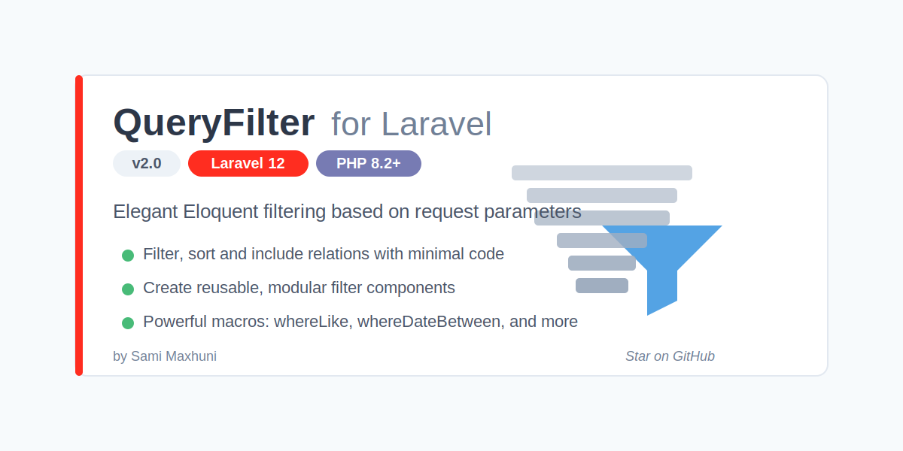

# QueryFilter for Laravel

A powerful and flexible package for filtering, sorting, and managing Eloquent queries based on request parameters. QueryFilter seamlessly extends Laravel's Eloquent builder, preserving all your favorite methods and macros while adding robust filtering capabilities.

## Requirements

- PHP 8.2+
- Laravel 10/11/12

## Installation

Install the package via Composer:

```bash
composer require samushi/queryfilter
```

## Table of Contents

- [Basic Usage](#basic-usage)
- [Creating Filters](#creating-filters)
- [Working with Arrays](#working-with-arrays)
- [Available Macros](#available-macros)
- [Advanced Usage](#advanced-usage)
- [Custom Filter Names](#custom-filter-names)
- [Best Practices](#best-practices)

## Basic Usage

### Quick Start

This package helps you filter Eloquent queries effortlessly based on request parameters.

**Step 1:** Create a `Filters` directory inside your `app` folder.

**Step 2:** Create filter classes that extend the base `Filter` class:

```php
namespace App\Filters;

use Samushi\QueryFilter\Filter;
use Illuminate\Database\Eloquent\Builder;

class Search extends Filter
{
    /**
     * Search results using whereLike
     *
     * @param Builder $builder
     * @return Builder
     */
    protected function applyFilter(Builder $builder): Builder
    {
        return $builder->whereLike(['name', 'email'], $this->getValue());
    }
}
```

**Step 3:** Apply filters in your controller:

```php
namespace App\Http\Controllers;

use App\Models\User;
use App\Filters\Search;
use Samushi\QueryFilter\Facade\QueryFilter;

class UserController extends Controller
{
    public function index()
    {
        $filters = [
            Search::class,
            // Add more filters here
        ];

        return QueryFilter::query(User::query(), $filters)->paginate(10);
    }
}
```

### Using the Model Method

You can use the `queryFilter` method directly on models for cleaner code:

```php
use App\Filters\Search;
use App\Filters\Status;
use App\Models\User;

// Usage in controller
$users = User::queryFilter([
    Search::class,
    Status::class,
])->paginate(10);
```

**Example Request:**
```
GET /users?search=john&status=active
```

## Creating Filters

### Filter Naming Convention

**Important:** By default, filter class names are automatically converted to snake_case to match request parameters.

| Class Name | Request Parameter |
|------------|-------------------|
| `Search` | `search` |
| `Status` | `status` |
| `PriceRange` | `price_range` |
| `CreatedDate` | `created_date` |

### Basic Filter Example

```php
namespace App\Filters;

use Samushi\QueryFilter\Filter;
use Illuminate\Database\Eloquent\Builder;

class Status extends Filter
{
    protected function applyFilter(Builder $builder): Builder
    {
        return $builder->where('status', $this->getValue());
    }
}
```

**Usage:**
```
GET /users?status=active
```

## Working with Arrays

### Overview

The `getValue()` method supports automatic array detection and conversion, making it easy to handle multiple values in your filters.

### Array Support Features

✅ **Comma-separated values**: `?status=active,pending,completed`
✅ **Array query parameters**: `?status[]=active&status[]=pending`
✅ **Automatic detection**: Detects arrays and converts them appropriately
✅ **Backward compatible**: Default behavior returns strings

### Using getValue() with Arrays

#### Default Behavior (String)

```php
class Search extends Filter
{
    protected function applyFilter(Builder $builder): Builder
    {
        // Returns string: "john doe"
        $value = $this->getValue();

        return $builder->where('name', 'like', "%{$value}%");
    }
}
```

**Request:** `GET /users?search=john doe`

#### Array Mode (Multiple Values)

```php
class Status extends Filter
{
    protected function applyFilter(Builder $builder): Builder
    {
        // Returns array: ["active", "pending", "completed"]
        $statuses = $this->getValue(true);

        return $builder->whereIn('status', $statuses);
    }
}
```

**Works with both formats:**
```
GET /users?status=active,pending,completed
GET /users?status[]=active&status[]=pending&status[]=completed
```

### Real-World Array Examples

#### Multiple Categories Filter

```php
namespace App\Filters;

use Samushi\QueryFilter\Filter;
use Illuminate\Database\Eloquent\Builder;

class Categories extends Filter
{
    protected function applyFilter(Builder $builder): Builder
    {
        $categories = $this->getValue(true); // Get as array

        return $builder->whereIn('category_id', $categories);
    }
}
```

**Usage:**
```
GET /products?categories=1,2,3,4
GET /products?categories[]=1&categories[]=2&categories[]=3
```

#### Multiple Tags Filter

```php
namespace App\Filters;

use Samushi\QueryFilter\Filter;
use Illuminate\Database\Eloquent\Builder;

class Tags extends Filter
{
    protected function applyFilter(Builder $builder): Builder
    {
        $tags = $this->getValue(true); // ["laravel", "php", "vue"]

        return $builder->whereHas('tags', function ($query) use ($tags) {
            $query->whereIn('name', $tags);
        });
    }
}
```

**Usage:**
```
GET /posts?tags=laravel,php,vue
GET /posts?tags[]=laravel&tags[]=php&tags[]=vue
```

#### Case Status Filter

```php
namespace App\Filters;

use Samushi\QueryFilter\Filter;
use Illuminate\Database\Eloquent\Builder;

class Cases extends Filter
{
    protected function applyFilter(Builder $builder): Builder
    {
        $cases = $this->getValue(true); // ["sent", "delivered", "failed"]

        return $builder->whereIn('case_status', $cases);
    }
}
```

**Usage:**
```
GET /orders?cases=sent,delivered,failed
GET /orders?cases[]=sent&cases[]=delivered&cases[]=failed
```

### How getValue() Works

| Input Type | `getValue()` | `getValue(true)` |
|------------|--------------|------------------|
| `?status=active` | `"active"` | `["active"]` |
| `?status=active,pending` | `"active,pending"` | `["active", "pending"]` |
| `?status[]=active&status[]=pending` | `"active,pending"` | `["active", "pending"]` |

### Array Detection Logic

The `getValue()` method intelligently handles arrays:

1. **Detects native arrays**: Automatically recognizes `?param[]=value` format
2. **Splits comma-separated values**: Converts `?param=val1,val2` to array when requested
3. **Trims whitespace**: Automatically cleans `?param=val1, val2, val3`
4. **Maintains compatibility**: Returns string by default, array only when `$asArray = true`

## Available Macros

### whereLike

Search across multiple columns or relationships with ease:

```php
// Search in a single column
$users = User::whereLike(['name'], $searchTerm)->get();

// Search across multiple columns
$users = User::whereLike(['name', 'email'], $searchTerm)->get();

// Search in relationship columns
$users = User::whereLike(['name', 'posts.title', 'comments.body'], $searchTerm)->get();
```

**Example Filter:**
```php
class Search extends Filter
{
    protected function applyFilter(Builder $builder): Builder
    {
        return $builder->whereLike(['name', 'email', 'phone'], $this->getValue());
    }
}
```

**Request:** `GET /users?search=john`

### whereDateBetween

Filter records between two dates with flexible formatting:

```php
// Default format: d/m/Y
$users = User::whereDateBetween('created_at', '01/01/2023', '31/12/2023')->get();

// Custom date formats
$users = User::whereDateBetween('created_at', '01-01-2023', '31-12-2023', 'd-m-Y', 'Y-m-d')->get();

// Different formats for start and end dates
$users = User::whereDateBetween('created_at', '2023/01/01', '31-12-2023', 'Y/m/d', 'd-m-Y')->get();
```

**Example Filter:**
```php
class DateRange extends Filter
{
    protected function applyFilter(Builder $builder): Builder
    {
        $dates = explode(',', $this->getValue());

        if (count($dates) === 2) {
            return $builder->whereDateBetween('created_at', $dates[0], $dates[1]);
        }

        return $builder;
    }
}
```

**Request:** `GET /users?date_range=01/01/2024,31/12/2024`

## Advanced Usage

### Price Range Filter

```php
namespace App\Filters;

use Samushi\QueryFilter\Filter;
use Illuminate\Database\Eloquent\Builder;

class PriceRange extends Filter
{
    protected function applyFilter(Builder $builder): Builder
    {
        $range = $this->getValue(true); // Get as array

        if (count($range) === 2) {
            return $builder->whereBetween('price', [$range[0], $range[1]]);
        }

        return $builder;
    }
}
```

**Usage:**
```
GET /products?price_range=10,100
GET /products?price_range[]=10&price_range[]=100
```

### Sort Filter

```php
namespace App\Filters;

use Samushi\QueryFilter\Filter;
use Illuminate\Database\Eloquent\Builder;

class Sort extends Filter
{
    protected function applyFilter(Builder $builder): Builder
    {
        $sortBy = $this->getValue(); // e.g., "price:desc" or "name:asc"

        [$column, $direction] = array_pad(explode(':', $sortBy), 2, 'asc');

        return $builder->orderBy($column, $direction);
    }
}
```

**Usage:**
```
GET /products?sort=price:desc
GET /products?sort=name:asc
```

### Active Records Filter

```php
namespace App\Filters;

use Samushi\QueryFilter\Filter;
use Illuminate\Database\Eloquent\Builder;

class Active extends Filter
{
    protected function applyFilter(Builder $builder): Builder
    {
        $isActive = filter_var($this->getValue(), FILTER_VALIDATE_BOOLEAN);

        return $builder->where('is_active', $isActive);
    }
}
```

**Usage:**
```
GET /users?active=true
GET /users?active=1
```

### Relationship Filter

```php
namespace App\Filters;

use Samushi\QueryFilter\Filter;
use Illuminate\Database\Eloquent\Builder;

class HasPosts extends Filter
{
    protected function applyFilter(Builder $builder): Builder
    {
        $hasPosts = filter_var($this->getValue(), FILTER_VALIDATE_BOOLEAN);

        return $hasPosts
            ? $builder->has('posts')
            : $builder->doesntHave('posts');
    }
}
```

**Usage:**
```
GET /users?has_posts=true
```

## Using Filters Outside HTTP Requests

### Overview

Filters can be used in **Jobs**, **Commands**, **Tests**, and other non-HTTP contexts by injecting data manually through the constructor.

### Manual Data Injection

Instead of relying on HTTP request parameters, you can pass data directly to filters:

```php
namespace App\Jobs;

use App\Models\Order;
use App\Filters\Status;
use App\Filters\DateRange;

class ProcessOrdersJob
{
    public function handle()
    {
        // Manual data injection
        $orders = Order::queryFilter([
            new Status(['status' => 'pending,processing']),
            new DateRange(['date_range' => '01/01/2024,31/12/2024']),
        ])->get();

        // Process orders...
    }
}
```

### Console Commands

```php
namespace App\Console\Commands;

use App\Models\User;
use App\Filters\Status;
use App\Filters\Role;
use Illuminate\Console\Command;

class ExportUsersCommand extends Command
{
    protected $signature = 'users:export {status} {role}';

    public function handle()
    {
        $users = User::queryFilter([
            new Status(['status' => $this->argument('status')]),
            new Role(['role' => $this->argument('role')]),
        ])->get();

        // Export users...
    }
}
```

**Usage:**
```bash
php artisan users:export active admin
```

### Unit Tests

```php
namespace Tests\Unit;

use App\Models\Product;
use App\Filters\PriceRange;
use App\Filters\Categories;
use Tests\TestCase;

class ProductFilterTest extends TestCase
{
    public function test_filters_products_by_price_and_category()
    {
        $products = Product::queryFilter([
            new PriceRange(['price_range' => '100,500']),
            new Categories(['categories' => '1,2,3']),
        ])->get();

        $this->assertCount(5, $products);
    }
}
```

### Mixed Usage (HTTP + Manual)

You can combine HTTP request parameters with manual data injection:

```php
// In Controller
// GET /products?search=laptop

public function index()
{
    $products = Product::queryFilter([
        SearchFilter::class, // Takes 'search' from HTTP request
        new PriceRange(['price_range' => '100,1000']), // Manual data
        new Stock(['stock' => 'in_stock']), // Manual data
    ])->paginate(10);
}
```

### Queue Jobs Example

```php
namespace App\Jobs;

use App\Models\Notification;
use App\Filters\Status;
use App\Filters\Priority;

class SendNotificationsJob implements ShouldQueue
{
    public function handle()
    {
        $notifications = Notification::queryFilter([
            new Status(['status' => 'pending']),
            new Priority(['priority' => 'high,urgent']),
        ])->get();

        foreach ($notifications as $notification) {
            // Send notification...
        }
    }
}
```

### Scheduled Tasks

```php
namespace App\Console\Kernel;

use App\Models\Order;
use App\Filters\Status;
use App\Filters\DateRange;
use Carbon\Carbon;

protected function schedule(Schedule $schedule)
{
    $schedule->call(function () {
        $yesterday = Carbon::yesterday()->format('d/m/Y');
        $today = Carbon::today()->format('d/m/Y');

        $orders = Order::queryFilter([
            new Status(['status' => 'completed']),
            new DateRange(['date_range' => "$yesterday,$today"]),
        ])->get();

        // Process completed orders...
    })->daily();
}
```

### How It Works

The filter automatically detects the data source:

1. **HTTP Request Context**: If no data is provided, filters read from HTTP request parameters
2. **Manual Data Context**: If data is provided via constructor, filters use that data
3. **Priority**: Manual data takes precedence over HTTP request parameters

```php
// HTTP Request (automatic)
StatusFilter::class → reads from request()->get('status')

// Manual Data (explicit)
new StatusFilter(['status' => 'active']) → uses provided data

// The filter name must match the array key
new Status(['status' => 'active']) → ✅ Correct
new Status(['state' => 'active'])  → ❌ Won't work (key mismatch)
```

## Custom Filter Names

Override the default snake_case naming convention by setting a custom `$name` property:

```php
namespace App\Filters;

use Samushi\QueryFilter\Filter;
use Illuminate\Database\Eloquent\Builder;

class Search extends Filter
{
    protected ?string $name = 'q'; // Use 'q' instead of 'search'

    protected function applyFilter(Builder $builder): Builder
    {
        return $builder->whereLike(['name', 'email'], $this->getValue());
    }
}
```

**Usage:**
```
GET /users?q=john  // Instead of ?search=john

// Or with manual data:
new Search(['q' => 'john']) // Must use 'q', not 'search'
```

## Best Practices

### 1. **Organize Filters by Feature**

```
app/
├── Filters/
│   ├── User/
│   │   ├── UserSearch.php
│   │   ├── UserStatus.php
│   │   └── UserRole.php
│   ├── Product/
│   │   ├── ProductCategory.php
│   │   ├── ProductPrice.php
│   │   └── ProductStock.php
```

### 2. **Use Type Hints and Return Types**

```php
protected function applyFilter(Builder $builder): Builder
{
    return $builder->where('status', $this->getValue());
}
```

### 3. **Validate Input in Filters**

```php
protected function applyFilter(Builder $builder): Builder
{
    $statuses = $this->getValue(true);
    $allowed = ['active', 'pending', 'completed'];

    $validated = array_intersect($statuses, $allowed);

    return $builder->whereIn('status', $validated);
}
```

### 4. **Combine Multiple Filters**

```php
$users = User::queryFilter([
    Search::class,
    Status::class,
    Role::class,
    DateRange::class,
])->paginate(10);
```

**Request:**
```
GET /users?search=john&status=active,pending&role=admin&date_range=01/01/2024,31/12/2024
```

### 5. **Use Arrays for Multiple Values**

Always use `getValue(true)` when filtering by multiple values:

```php
// ✅ Good
$categories = $this->getValue(true);
return $builder->whereIn('category_id', $categories);

// ❌ Bad
$categories = explode(',', $this->getValue());
return $builder->whereIn('category_id', $categories);
```

### 6. **Handle Empty Values Gracefully**

The filter automatically skips when the parameter is missing or empty, but you can add custom logic:

```php
protected function applyFilter(Builder $builder): Builder
{
    $value = $this->getValue();

    if (empty($value)) {
        return $builder; // Skip filter
    }

    return $builder->where('status', $value);
}
```

## License

The MIT License (MIT). Please see the [License File](LICENSE) for more information.