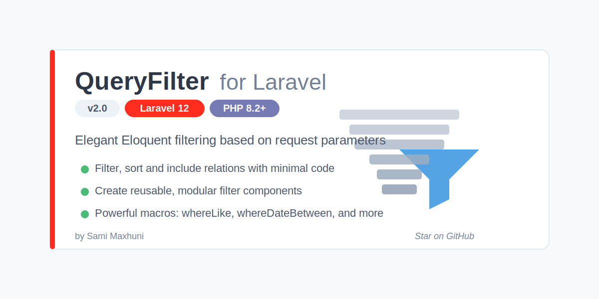

# QueryFilter for Laravel

This package allows you to filter, sort and include eloquent relations based on a request. The QueryFilter used in this package extends Laravel's default Eloquent builder. This means all your favorite methods and macros are still available.

## Requirements

- PHP 8.2+
- Laravel 10/11/12

## Installation

Follow the steps below to install the package.

### Composer
```bash
composer require samushi/queryfilter
```

## Basic Usage

This package helps you easily filter your Eloquent queries based on request parameters.

### Creating Filters

**Step 1:** Create a `Filters` directory inside your `app` folder, then create filter classes:

**Step 2:** Create a filter class (e.g., `Search.php`):

```php
namespace App\Filters;

use Samushi\QueryFilter\Filter;
use Illuminate\Database\Eloquent\Builder;

class Search extends Filter
{
    /**
     * Search results using whereLike
     * 
     * @param Builder $builder
     * @return Builder
     */
    protected function applyFilter(Builder $builder): Builder
    {
        // Search with relationship: ['name', 'posts.title']
        return $builder->whereLike(['name'], $this->getValue());
    }
}
```

**Note:** Filter class names must match request parameter names. For example, the `Search` class corresponds to `request()->input('search')`.

### Using Filters in Controllers

```php
namespace App\Http\Controllers;

use App\Models\User;
use App\Filters\Search;
use Samushi\QueryFilter\Facade\QueryFilter;

class UserController extends Controller
{
    public function index()
    {
        $filters = [
            Search::class,
            // Add more filters here
        ];

        return QueryFilter::query(User::query(), $filters)->paginate(10);
    }
}
```

## Available Macros

### whereLike

Search in multiple columns or relationships:

```php
// Search in name column
$users = User::whereLike(['name'], $searchTerm)->get();

// Search in name and email columns
$users = User::whereLike(['name', 'email'], $searchTerm)->get();

// Search in relationship columns
$users = User::whereLike(['name', 'posts.title'], $searchTerm)->get();
```

### whereDateBetween

Filter records between two dates:

```php
// Default format: d/m/Y
$users = User::whereDateBetween('created_at', '01/01/2023', '31/12/2023')->get();

// Custom formats
$users = User::whereDateBetween('created_at', '01-01-2023', '31-12-2023', 'd-m-Y', 'Y-m-d')->get();
```

## Creating Custom Filters

You can create custom filters by extending the base `Filter` class:

```php
namespace App\Filters;

use Samushi\QueryFilter\Filter;
use Illuminate\Database\Eloquent\Builder;

class PriceRange extends Filter
{
    protected function applyFilter(Builder $builder): Builder
    {
        $range = explode(',', $this->getValue());
        
        if (count($range) === 2) {
            return $builder->whereBetween('price', [$range[0], $range[1]]);
        }
        
        return $builder;
    }
}
```

Then use it in your controller:

```php
// Usage: ?price_range=10,100
```

## License

The MIT License (MIT). Please see the [License File](LICENSE) for more information.